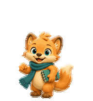

# Codex Pets

Custom animated pets for Codex. Each pet is packaged as a v2 `8 × 11` spritesheet with its matching `pet.json`.

## Pets

### Linwan

一个沉着、优雅的办公室秘书型伴侣，负责把任务整理得井井有条。以下预览由当前发布的图集直接导出。


Files: [`pet.json`](assets/linwan/pet.json) · [`spritesheet.webp`](assets/linwan/spritesheet.webp)

### Pixelwhim

一个好奇又有创造力的小伙伴，喜欢把半成形的想法变成精致的小世界。




Files: [`pet.json`](assets/pixelwhim/pet.json) · [`spritesheet.webp`](assets/pixelwhim/spritesheet.webp)

## Install locally

Copy a pet directory into `~/.codex/pets/` and restart Codex if the pet does not appear immediately:

```bash
cp -R assets/linwan ~/.codex/pets/linwan
# or
cp -R assets/pixelwhim ~/.codex/pets/pixelwhim
```

## Layout

Rows `0–8` are the standard Codex animations. Rows `9–10` contain the 16 clockwise look directions. The atlas uses `spriteVersionNumber: 2` and 192 × 208 pixel cells.
